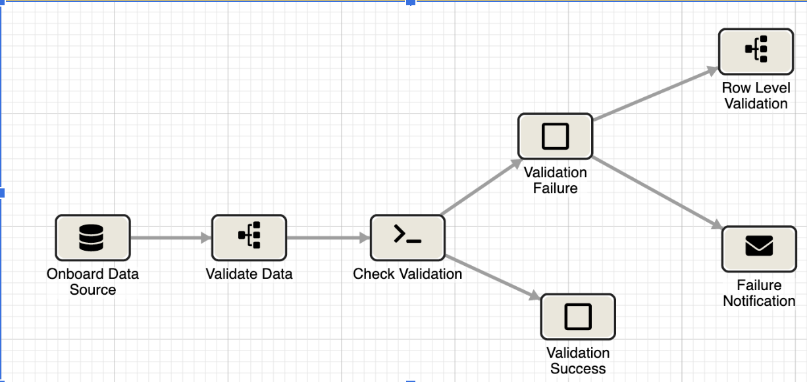

# Infoworks Data Validator

## Table of Contents
- [Introduction](#introduction)
- [Documentation](#documentation)
- [Usage](#usage)
- [Available Parameters](#parameters)
- [Authors](#authors)

## Introduction
Infoworks DataValidator is a tool that helps in creating Infoworks pipelines to validate 2 tables by computing the column checksum, row checksum and create a final data validation summary report.
This solution follows a layered approach to validation and creates pipelines using Infoworks Rest APIs.

Infoworks Data Validator, provides seamless integration, automated, scalable and repeatable solution for data validation across different environments.

The adapter uses the Infoworks platform to connect to a large number of data sources and automatically validates data integrity at every step of the data migration process.

Once the Data Validation pipelines are created, these processes can then be orchestrated in Infoworks to deliver the automated solution with notification.


Supports Infoworks version 5.3 onwards.




## Documentation

White paper can be found here: https://www.infoworks.io/resource/accelerating-data-validation-at-scale/

## Requirements

Python 3.4+ 

## Usage

- Clone the repo https://github.com/Infoworks/infoworks-mass-data-validation-utility
- Navigate to **data_validation_pipelines** or **data_profiling_pipelines** and modify the parameter file input_data.csv and config.ini as needed.
  <br> The config.ini file is self-explanatory with comments embedded within it.
  <br> All the available parameters in **input_data.csv** has been described in the later section below.
- Make sure to have python version 3 installed on the machine where the script is to be run. 
- Run below set of commands to initialize the python virtual environment,

```python
cd data_validation_pipelines # or cd data_profiling_pipelines
python3 -m venv venv
source env/bin/activate
pip install -r requirements.txt
```

- Run the script as shown below to create pipelines in bulk,
```python
cd data_validation_pipelines; python bulk_validation_pipelines.py 

cd data_profiling_pipelines; python profiling_pipelines.py --pipeline_number prof_pipeline1/prof_pipeline2/both
```

## Available Parameters
Below is the description of all the available parameters for data validation script in input_data.csv file

| Parameter                 | Description                                                                                                                     |
|---------------------------|---------------------------------------------------------------------------------------------------------------------------------|
| pl_suffix                 | Suffix with which the pipelines have to be created. Usually this can be table name                                              |
| source_table_name         | Fully qualified source table name. Example: default.sample_customer_table_src                                                   |
| target_table_name         | Fully qualified target table name. Example: default.sample_customer_table_tgt                                                   |
| source_name_to_fetchcols  | Source Name in Infoworks under which Bigquery tables are crawled. This information is needed to fetch the list of columns names |
| chksum_agg_cols           | Comma separated list of columns on which aggregation is performed. By default all columns part of source table                  |
| chksum_group_cols         | Comma separated list of columns on which group by is performed                                                                  |
| distinct_count_cols       | Comma separated list of columns on which distinct count is performed during row level validation                                |
| full_outer_join_cols      | Comma separated list of columns on which the source and target tables are joined in row checksum pipelines                      |
| regex_exp                 | Regular expression to remove ascii characters from data. **Default**: '[\\W&&[^\\s+]]'                                          |
| remove_ascii_from_cols    | List of columns from which ascii characters are to be removed. **Default**: All string columns if regex_replace is enabled      |
| regex_replace             | True/False. Variable to enable/disable removing of ascii characters from string columns                                         |
| natural_keys              | Comma separated list of columns to be configured as natural keys                                                                |
| pipeline_tgt_dataset_name | Target Dataset in Big query in which pipeline targets are to be created                                                         |
| data_profiling            | True/False. If set to True, data profiling columns will be enabled in  the column checksum pipeline                             |

Below is the description of all the available parameters for data profiling script in input_data.csv file

| Parameter                 | Description                                                                                                                     |
|---------------------------|---------------------------------------------------------------------------------------------------------------------------------|
| pl_suffix                 | Suffix with which the pipelines have to be created. Usually this can be table name                                              |
| source_table_name         | Fully qualified source table name. Example: default.sample_customer_table_src                                                   |
| target_table_name         | Fully qualified target table name. Example: default.sample_customer_table_tgt                                                   |
| source_name_to_fetchcols  | Source Name in Infoworks under which Bigquery tables are crawled. This information is needed to fetch the list of columns names |
| group_by_cols             | Comma separated list of columns on which group by is performed                                                                  |
| pipeline_tgt_dataset_name | Target Dataset in Big query in which pipeline targets are to be created                                                         |
| dataconnection_id         | Entity identifier of BigQuery Data connection to be used in the profiling source pipelines                                      |
| dataconnection_name       | BigQuery Data connection name to be used in the profiling source pipelines                                                      |

## Authors

Abhishek Raviprasad (abhishek.raviprasad@infoworks.io)
